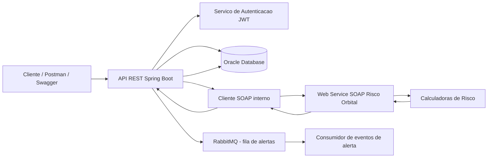
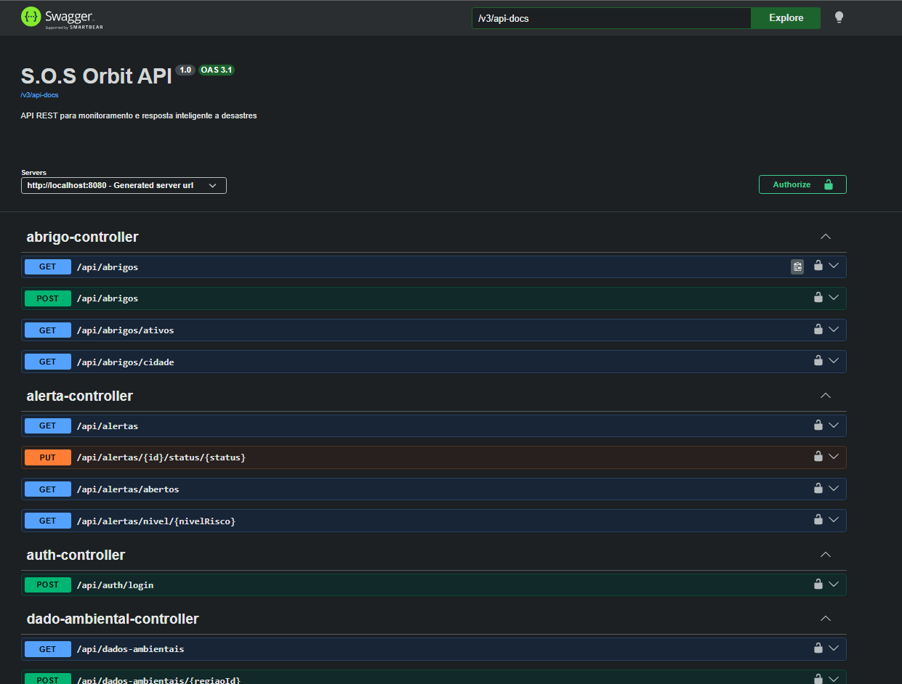
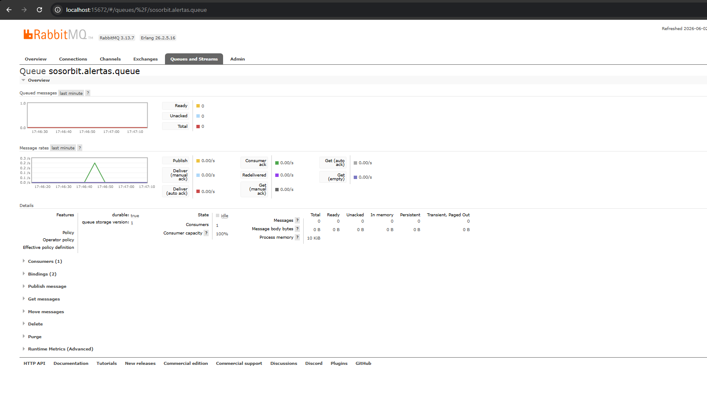
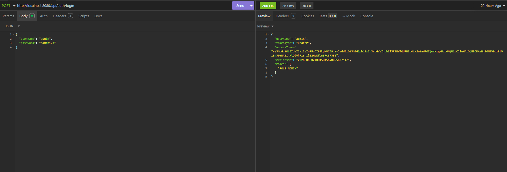
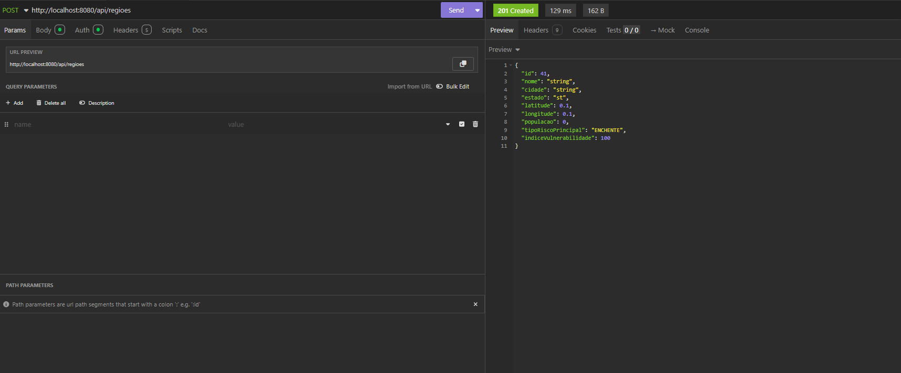
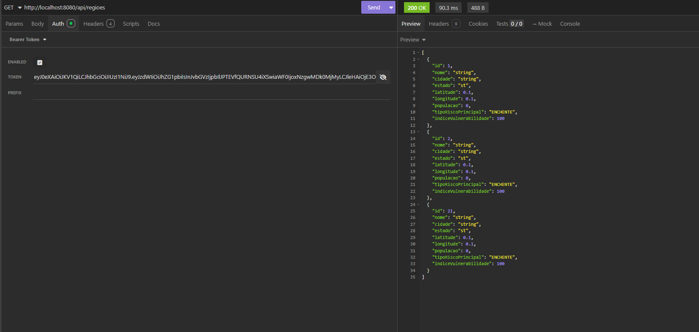
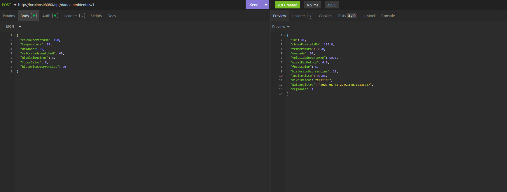
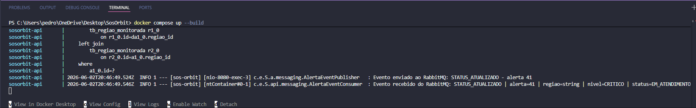
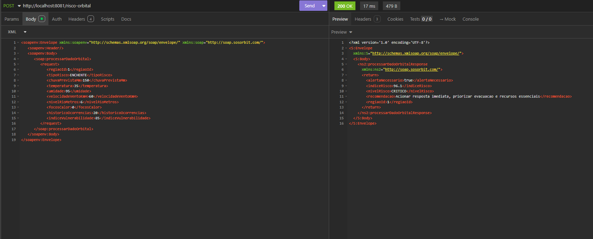
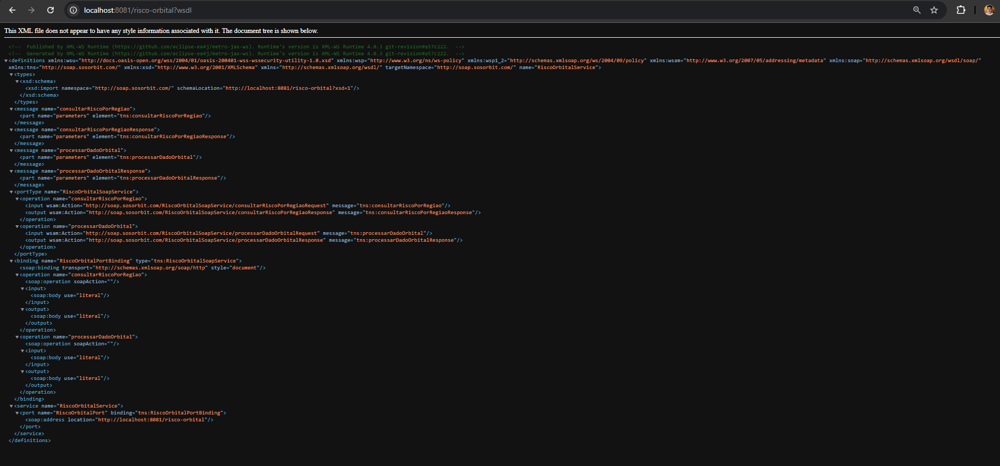

# S.O.S Orbit

Plataforma espacial de resposta inteligente a desastres naturais.

## Integrantes

Pedro Oliveira - 99943
Diego Cabral - 557817
Débora Ivanowski - 555694

## Descricao Da Solucao

O S.O.S Orbit e uma solucao baseada em arquitetura orientada a servicos para prever, detectar e coordenar respostas a desastres naturais usando dados ambientais, dados orbitais simulados, geolocalizacao e regras de risco.

A aplicacao permite cadastrar regioes monitoradas, registrar dados ambientais, calcular indice de risco, gerar alertas, cadastrar abrigos e organizar recursos de resposta.

## Problema Resolvido

Muitas cidades reagem apenas depois que um desastre ja aconteceu. O S.O.S Orbit apoia a prevencao ao calcular risco por regiao e acionar alertas quando uma situacao chega a nivel alto ou critico.

Exemplos de riscos tratados:

- Enchente
- Queimada
- Deslizamento
- Seca

## Objetivos

- Monitorar regioes vulneraveis.
- Registrar dados ambientais de risco.
- Calcular o indice de risco automaticamente.
- Gerar alertas para Defesa Civil e equipes de resposta.
- Cadastrar abrigos e recursos.
- Demonstrar integracao entre API REST e Web Service SOAP.
- Aplicar principios de SOA: baixo acoplamento, reutilizacao de servicos, contratos, interoperabilidade e separacao de responsabilidades.

## Tecnologias Utilizadas

- Java 17
- Spring Boot
- Spring Web
- Spring Data JPA
- Spring Security
- JWT
- Oracle Database
- RabbitMQ
- JAX-WS
- JAXB
- Swagger / OpenAPI
- Maven
- Docker

## Arquitetura Do Projeto

```text
src/main/java/com/example/SosOrbit
|
|-- api
|   |-- config
|   |-- controller
|   |-- dto
|   |-- exception
|   |-- integration
|   |-- model
|   |-- repository
|   |-- risco
|   |-- security
|   |-- service
|   |-- validation
|
|-- soap
|   |-- model
|   |-- publisher
|   |-- service
|
|-- SosOrbitApplication.java
```

## Diagrama De Arquitetura SOA



## Fluxo Principal

```text
1. Usuario faz login na API REST.
2. Usuario cadastra uma regiao monitorada.
3. Usuario registra dados ambientais da regiao.
4. API REST chama o Web Service SOAP.
5. SOAP processa os dados e calcula o risco.
6. REST recebe o resultado do SOAP.
7. REST salva o dado ambiental no banco.
8. Se o risco for ALTO ou CRITICO, REST gera um alerta.
9. REST publica um evento de alerta no RabbitMQ.
10. O consumidor recebe o evento e registra o processamento.
11. Usuario consulta alertas, abrigos e recursos.
```

## Banco De Dados

O projeto usa Oracle Database via Spring Data JPA.

Configuracao em:

```text
src/main/resources/application.properties
```

Exemplo de configuracao:

```properties
spring.datasource.url=jdbc:oracle:thin:@oracle.fiap.com.br:1521:ORCL
spring.datasource.username=SEU_USUARIO
spring.datasource.password=SUA_SENHA
spring.datasource.driver-class-name=oracle.jdbc.OracleDriver
spring.jpa.hibernate.ddl-auto=update
```

Principais tabelas:

- TB_REGIAO_MONITORADA
- TB_DADO_AMBIENTAL
- TB_ALERTA
- TB_ABRIGO
- TB_RECURSO

## Como Rodar

Na pasta do projeto:

```powershell
mvn spring-boot:run
```

Ou usando o Maven Wrapper:

```powershell
.\mvnw.cmd spring-boot:run
```

Servicos publicados:

```text
REST: http://localhost:8080
Swagger: http://localhost:8080/swagger-ui
SOAP: http://localhost:8081/risco-orbital
WSDL: http://localhost:8081/risco-orbital?wsdl
```

## Como Rodar Com Docker

Requisito:

- Docker Desktop instalado e em execucao.

Antes de subir os containers, confira se o Docker esta ativo:

```powershell
docker ps
```

Se esse comando falhar, abra o Docker Desktop e espere o Docker Engine iniciar.

Subir RabbitMQ e API:

```powershell
docker compose up --build
```

Servicos:

```text
REST: http://localhost:8080
SOAP: http://localhost:8081/risco-orbital
RabbitMQ Management: http://localhost:15672
```

No Docker, o SOAP e publicado internamente em `0.0.0.0:8081` para permitir acesso pelo host, mas os testes continuam usando `http://localhost:8081/risco-orbital`.

Credenciais do RabbitMQ:

| Usuario | Senha |
| --- | --- |
| guest | guest |

Para subir apenas o RabbitMQ e rodar a API pelo VS Code:

```powershell
docker compose up rabbitmq
mvn spring-boot:run
```

Fila principal:

```text
sosorbit.alertas.queue
```

Exchange:

```text
sosorbit.alertas.exchange
```

## Autenticacao JWT

Endpoint de login:

```http
POST http://localhost:8080/api/auth/login
```

Usuarios de teste:

| Usuario | Senha | Perfil |
| --- | --- | --- |
| admin | admin123 | ADMIN |
| defesa | defesa123 | DEFESA_CIVIL |
| operador | 123456 | OPERADOR |

Exemplo de requisicao:

```json
{
  "username": "admin",
  "password": "admin123"
}
```

Exemplo de resposta:

```json
{
  "username": "admin",
  "tokenType": "Bearer",
  "accessToken": "TOKEN_GERADO",
  "expiresAt": "2026-05-29T22:00:00Z",
  "roles": [
    "ROLE_ADMIN"
  ]
}
```

Nas proximas requisicoes REST protegidas, usar:

```http
Authorization: Bearer TOKEN_GERADO
```

## API REST

### Regioes Monitoradas

CRUD principal do projeto.

#### Criar Regiao

```http
POST http://localhost:8080/api/regioes
Content-Type: application/json
Authorization: Bearer TOKEN_GERADO
```

```json
{
  "nome": "Marginal Tiete",
  "cidade": "Sao Paulo",
  "estado": "SP",
  "latitude": -23.5204,
  "longitude": -46.6333,
  "populacao": 120000,
  "tipoRiscoPrincipal": "ENCHENTE",
  "indiceVulnerabilidade": 85
}
```

#### Listar Regioes

```http
GET http://localhost:8080/api/regioes
Authorization: Bearer TOKEN_GERADO
```

#### Buscar Regiao Por Id

```http
GET http://localhost:8080/api/regioes/1
Authorization: Bearer TOKEN_GERADO
```

#### Atualizar Regiao

```http
PUT http://localhost:8080/api/regioes/1
Content-Type: application/json
Authorization: Bearer TOKEN_GERADO
```

```json
{
  "nome": "Marginal Tiete Atualizada",
  "cidade": "Sao Paulo",
  "estado": "SP",
  "latitude": -23.5204,
  "longitude": -46.6333,
  "populacao": 130000,
  "tipoRiscoPrincipal": "ENCHENTE",
  "indiceVulnerabilidade": 90
}
```

#### Deletar Regiao

```http
DELETE http://localhost:8080/api/regioes/1
Authorization: Bearer TOKEN_GERADO
```

### Dados Ambientais

Este endpoint demonstra a integracao REST -> SOAP.

```http
POST http://localhost:8080/api/dados-ambientais/1
Content-Type: application/json
Authorization: Bearer TOKEN_GERADO
```

```json
{
  "chuvaPrevistaMm": 150,
  "temperatura": 35,
  "umidade": 95,
  "velocidadeVentoKmH": 60,
  "nivelRioMetros": 6,
  "focosCalor": 0,
  "historicoOcorrencias": 20
}
```

Resposta esperada:

```json
{
  "id": 1,
  "chuvaPrevistaMm": 150.0,
  "temperatura": 35.0,
  "umidade": 95,
  "velocidadeVentoKmH": 60.0,
  "nivelRioMetros": 6.0,
  "focosCalor": 0,
  "historicoOcorrencias": 20,
  "indiceRisco": 100.0,
  "nivelRisco": "CRITICO",
  "dataRegistro": "2026-05-29T19:00:00",
  "regiaoId": 1
}
```

#### Atualizar Dado Ambiental

```http
PUT http://localhost:8080/api/dados-ambientais/1
Content-Type: application/json
Authorization: Bearer TOKEN_GERADO
```

```json
{
  "chuvaPrevistaMm": 120,
  "temperatura": 32,
  "umidade": 88,
  "velocidadeVentoKmH": 45,
  "nivelRioMetros": 5,
  "focosCalor": 0,
  "historicoOcorrencias": 15
}
```

#### Deletar Dado Ambiental

```http
DELETE http://localhost:8080/api/dados-ambientais/1
Authorization: Bearer TOKEN_GERADO
```

### Alertas

```http
GET http://localhost:8080/api/alertas
Authorization: Bearer TOKEN_GERADO
```

```http
GET http://localhost:8080/api/alertas/abertos
Authorization: Bearer TOKEN_GERADO
```

```http
PUT http://localhost:8080/api/alertas/1/status/EM_ATENDIMENTO
Authorization: Bearer TOKEN_GERADO
```

```http
PUT http://localhost:8080/api/alertas/1
Content-Type: application/json
Authorization: Bearer TOKEN_GERADO
```

```json
{
  "titulo": "Risco critico atualizado",
  "mensagem": "Atendimento em andamento com prioridade alta.",
  "indiceRisco": 95,
  "nivelRisco": "CRITICO",
  "status": "EM_ATENDIMENTO"
}
```

```http
DELETE http://localhost:8080/api/alertas/1
Authorization: Bearer TOKEN_GERADO
```

Status possiveis:

```text
ABERTO
EM_ATENDIMENTO
FINALIZADO
```

### Abrigos

```http
POST http://localhost:8080/api/abrigos
Content-Type: application/json
Authorization: Bearer TOKEN_GERADO
```

```json
{
  "nome": "Escola Municipal Central",
  "endereco": "Rua das Flores, 100",
  "cidade": "Sao Paulo",
  "estado": "SP",
  "latitude": -23.521,
  "longitude": -46.64,
  "capacidade": 300,
  "vagasDisponiveis": 250,
  "ativo": true
}
```

```http
PUT http://localhost:8080/api/abrigos/1
Content-Type: application/json
Authorization: Bearer TOKEN_GERADO
```

```json
{
  "nome": "Escola Municipal Central",
  "endereco": "Rua das Flores, 100",
  "cidade": "Sao Paulo",
  "estado": "SP",
  "latitude": -23.521,
  "longitude": -46.64,
  "capacidade": 350,
  "vagasDisponiveis": 300,
  "ativo": true
}
```

```http
DELETE http://localhost:8080/api/abrigos/1
Authorization: Bearer TOKEN_GERADO
```

Validacao customizada:

```text
vagasDisponiveis nao pode ser maior que capacidade
```

### Recursos

```http
POST http://localhost:8080/api/recursos/1
Content-Type: application/json
Authorization: Bearer TOKEN_GERADO
```

```json
{
  "tipo": "AGUA",
  "descricao": "Galoes de agua potavel",
  "quantidade": 120,
  "unidadeMedida": "unidades",
  "prioridade": "URGENTE",
  "status": "DISPONIVEL"
}
```

```http
PUT http://localhost:8080/api/recursos/1
Content-Type: application/json
Authorization: Bearer TOKEN_GERADO
```

```json
{
  "tipo": "AGUA",
  "descricao": "Galoes de agua potavel atualizados",
  "quantidade": 180,
  "unidadeMedida": "unidades",
  "prioridade": "URGENTE",
  "status": "EM_USO"
}
```

```http
DELETE http://localhost:8080/api/recursos/1
Authorization: Bearer TOKEN_GERADO
```

## Web Service SOAP

URL do servico:

```text
http://localhost:8081/risco-orbital
```

WSDL:

```text
http://localhost:8081/risco-orbital?wsdl
```

Headers para testar no Postman, Insomnia ou SoapUI:

```http
Content-Type: text/xml;charset=UTF-8
Accept: text/xml
```

### Operacao: processarDadoOrbital

Esta operacao processa dados ambientais/orbitais e retorna o indice e nivel de risco.

```xml
<soapenv:Envelope xmlns:soapenv="http://schemas.xmlsoap.org/soap/envelope/" xmlns:soap="http://soap.sosorbit.com/">
   <soapenv:Header/>
   <soapenv:Body>
      <soap:processarDadoOrbital>
         <request>
            <regiaoId>1</regiaoId>
            <tipoRisco>ENCHENTE</tipoRisco>
            <chuvaPrevistaMm>150</chuvaPrevistaMm>
            <temperatura>35</temperatura>
            <umidade>95</umidade>
            <velocidadeVentoKmH>60</velocidadeVentoKmH>
            <nivelRioMetros>6</nivelRioMetros>
            <focosCalor>0</focosCalor>
            <historicoOcorrencias>20</historicoOcorrencias>
            <indiceVulnerabilidade>85</indiceVulnerabilidade>
         </request>
      </soap:processarDadoOrbital>
   </soapenv:Body>
</soapenv:Envelope>
```

Resposta esperada:

```xml
<S:Envelope xmlns:S="http://schemas.xmlsoap.org/soap/envelope/">
   <S:Body>
      <ns2:processarDadoOrbitalResponse xmlns:ns2="http://soap.sosorbit.com/">
         <return>
            <alertaNecessario>true</alertaNecessario>
            <indiceRisco>100.0</indiceRisco>
            <nivelRisco>CRITICO</nivelRisco>
            <recomendacao>Acionar resposta imediata, priorizar evacuacao e recursos essenciais</recomendacao>
            <regiaoId>1</regiaoId>
         </return>
      </ns2:processarDadoOrbitalResponse>
   </S:Body>
</S:Envelope>
```

### Operacao: consultarRiscoPorRegiao

Consulta o ultimo risco processado pelo SOAP para uma regiao.

```xml
<soapenv:Envelope xmlns:soapenv="http://schemas.xmlsoap.org/soap/envelope/" xmlns:soap="http://soap.sosorbit.com/">
   <soapenv:Header/>
   <soapenv:Body>
      <soap:consultarRiscoPorRegiao>
         <regiaoId>1</regiaoId>
      </soap:consultarRiscoPorRegiao>
   </soapenv:Body>
</soapenv:Envelope>
```

## Integracao Entre REST E SOAP

A integracao obrigatoria da entrega acontece no cadastro de dados ambientais.

```text
POST /api/dados-ambientais/{regiaoId}
```

Fluxo:

```text
DadoAmbientalController
-> DadoAmbientalService
-> RiscoOrbitalSoapClient
-> RiscoOrbitalSoapService
-> CalculadoraRisco
-> RiscoOrbitalSoapService
-> DadoAmbientalService
-> Banco Oracle
```

O REST usa o resultado do SOAP para preencher:

- indiceRisco
- nivelRisco
- alertaNecessario
- recomendacao

Se o nivel for ALTO ou CRITICO, o REST cria um alerta no banco.

## Tratamento De Erros

Os endpoints REST retornam erros em JSON pelo `GlobalExceptionHandler`.

Formato padrao:

```json
{
  "timestamp": "2026-06-01T20:15:00",
  "status": 404,
  "error": "Not Found",
  "message": "Regiao nao encontrada",
  "path": "/api/regioes/999999999",
  "fields": {}
}
```

Erros tratados:

- `400 Bad Request`: validacao, enum invalido, JSON mal formatado ou parametro obrigatorio ausente.
- `401 Unauthorized`: login invalido ou token ausente.
- `403 Forbidden`: usuario autenticado sem permissao.
- `404 Not Found`: recurso inexistente.
- `409 Conflict`: violacao de integridade no banco.
- `502 Bad Gateway`: falha na integracao REST -> SOAP.
- `500 Internal Server Error`: erro inesperado.

## Mensageria Com RabbitMQ

A mensageria foi adicionada como diferencial da arquitetura.

Quando um alerta e criado ou quando seu status muda, a aplicacao publica um evento na fila RabbitMQ.

Fluxo:

```text
Alerta criado/atualizado
-> AlertaEventPublisher
-> RabbitMQ Exchange
-> RabbitMQ Queue
-> AlertaEventConsumer
```

Classes principais:

- `RabbitMqConfig`
- `AlertaRiscoEvent`
- `AlertaEventPublisher`
- `AlertaEventConsumer`

Exemplo de evento enviado:

```json
{
  "tipoEvento": "ALERTA_CRIADO",
  "alertaId": 1,
  "regiaoId": 1,
  "nomeRegiao": "Marginal Tiete",
  "cidade": "Sao Paulo",
  "estado": "SP",
  "nivelRisco": "CRITICO",
  "indiceRisco": 100.0,
  "status": "ABERTO",
  "mensagem": "Indice de risco chegou a 100. Verificar abrigos, rotas seguras e recursos para resposta."
}
```

## POO Aplicada

O projeto aplica POO principalmente na camada de risco:

- Abstracao: `CalculadoraRisco`
- Heranca: `CalculadoraRiscoEnchente`, `CalculadoraRiscoQueimada`, `CalculadoraRiscoSeca`, `CalculadoraRiscoDeslizamento`
- Polimorfismo: a factory retorna uma calculadora diferente conforme o tipo de risco
- Encapsulamento: atributos privados nas entidades e acesso por getters/setters

## Evidencias De Funcionamento

### Swagger



### RabbitMQ



### Login JWT



### Criacao De Regiao Monitorada



### Listagem De Regioes



### Cadastro De Dados Ambientais



### Logs Do RabbitMQ



### SOAP - Processamento De Risco Orbital



### SOAP - WSDL Publicado



## ODS Relacionados

O projeto se relaciona com:

- Industria, inovacao e infraestrutura
- Cidades e comunidades sustentaveis
- Acao contra a mudanca global do clima

## Conclusao

O S.O.S Orbit demonstra uma solucao SOA no contexto Space Connect, integrando uma API REST com um Web Service SOAP para processar riscos de desastres naturais. A aplicacao usa persistencia em banco de dados, autenticacao JWT, validacoes, tratamento de erros, mensageria com RabbitMQ, Docker e documentacao dos contratos REST e SOAP.
